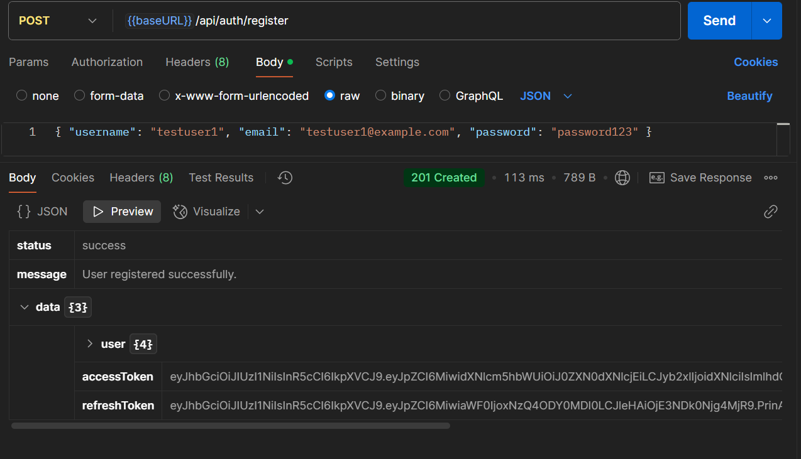
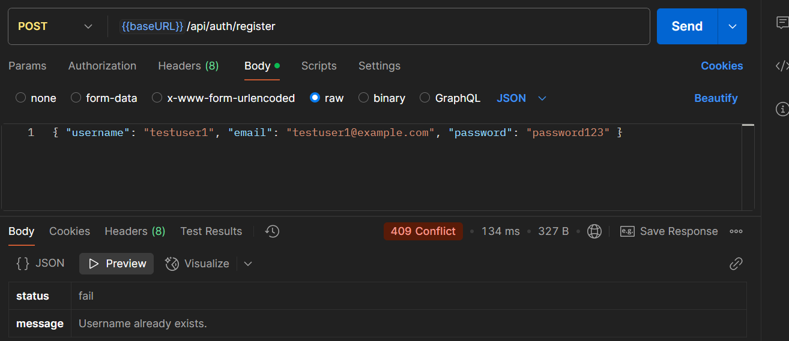
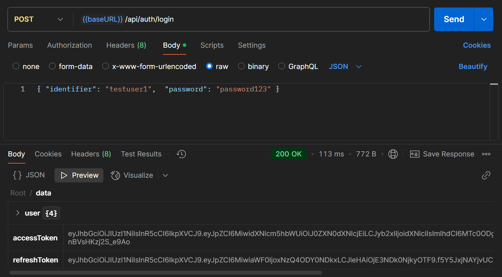
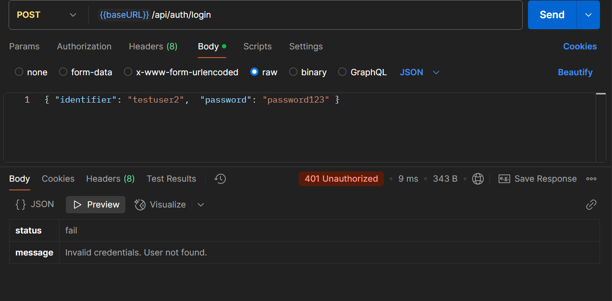
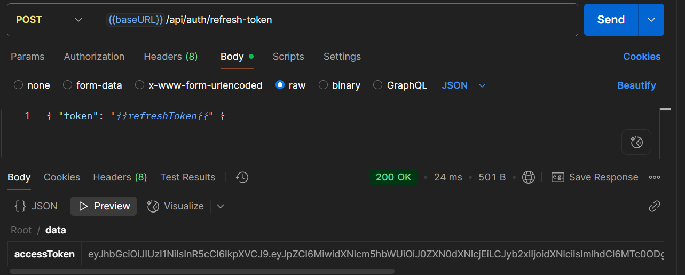
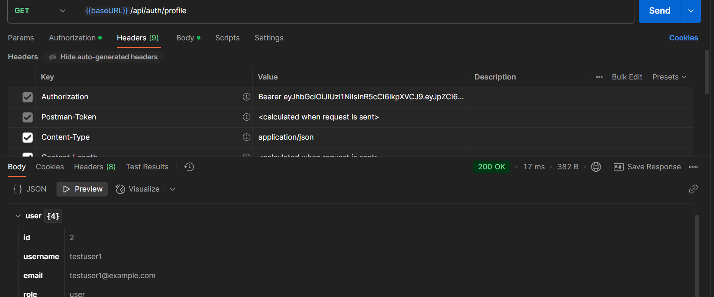
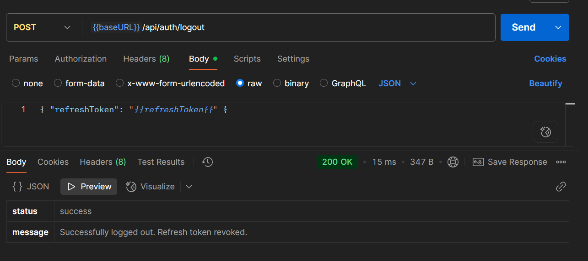

# Authentication & Authorization API (Node.js, Express, MySQL)

Proyek ini merupakan sistem backend untuk autentikasi dan otorisasi pengguna menggunakan standar keamanan OAuth2 (konsep dasar) dan JSON Web Token (JWT). API ini menyediakan endpoint yang aman untuk registrasi, login, refresh token, serta membatasi akses berdasarkan peran pengguna.

## Fitur Utama

*   Registrasi & Login Pengguna
*   Generasi Token JWT (Access & Refresh Token)
*   Mekanisme Refresh Token
*   Role-Based Access Control (RBAC)
*   Hashing Password yang Aman (bcryptjs)
*   Middleware Autentikasi & Otorisasi
*   Logout & Pencabutan Token (Spesifik & Semua Sesi)

## Teknologi yang Digunakan

*   Node.js
*   Express.js
*   MySQL (dengan `mysql2` driver)
*   JSON Web Token (`jsonwebtoken`)
*   BcryptJS (`bcryptjs`)
*   Dotenv (`dotenv`)
*   Express Validator (`express-validator`)
*   CORS (`cors`)

## API Endpoints (Ringkasan)

*   `POST /api/auth/register`
*   **Respons Sukses (Status 201 Created):**

*   **Respons Gagal (Username Sudah Ada - Status 409 Conflict):**

*   `POST /api/auth/login`
*   **Respons Sukses (Status 200 Ok):**

*   **Respons Gagal (Status 401 Kredensial Salah):**

*   `POST /api/auth/refresh-token`
*   **Respons Sukses (Status 200 Ok):**

*   `GET /api/auth/profile` (Protected)
*   **Respons Sukses (Status 200 Ok):**

*   `POST /api/auth/logout`
**Respons Sukses (Status 200 Ok):**

---

Proyek ini dilisensikan di bawah [Lisensi MIT](LICENSE.md).
